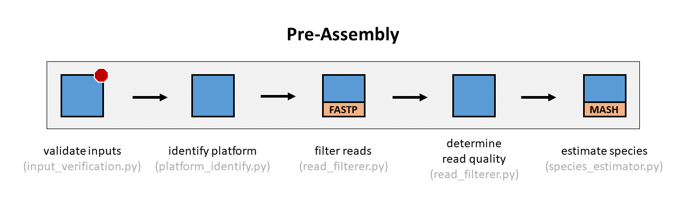
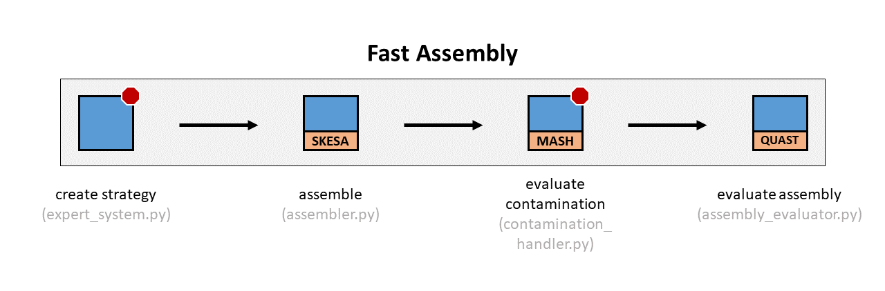
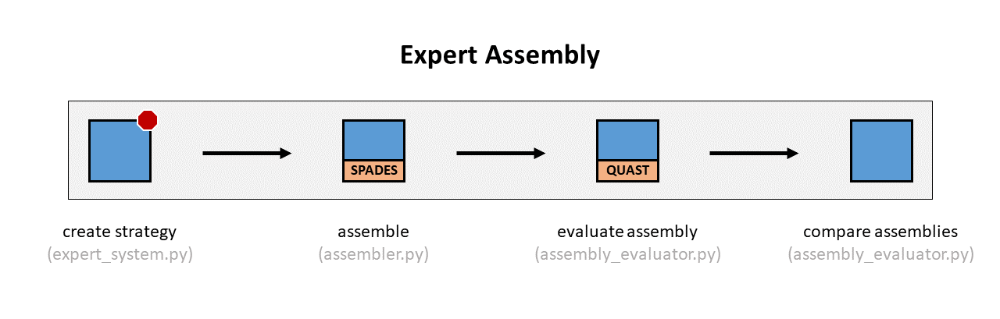

# Proksee Assemble Overview

v1.0.0  
2021-02-04

The assemble command is responsible for assembling sequencing reads into contigs. It uses an expert system to guide decision-making through the various stages of assembly.

## Pipeline

The assemble pipeline consists of three major stages:

- **Stage 1: Pre-Assembly**: Attempts to estimate information about the reads and prepares the reads for sequence assembly.
- **Stage 2: Fast Assembly**: Assembles the quickly in order to produce a draft assemble that will help inform the expert assembly.
- **Stage 3: Expert Assembly**: Assembles the reads in an expert manner using information gathered during the previous stages.

## Stage 1: Pre-Assembly

The pre-assembly stage is responsible for estimating information about the reads, including the species and sequencing technology, and preparing the reads for sequence assembly.

### Validate Inputs

The forward and reverse read inputs are validated in order to ensure that they are in FASTQ format. The pipeline will terminate if the inputs appear to be formatted incorrectly.

### Identify Sequencing Platform

The sequencing platform is estimated by looking at the encoding of the FASTQ-formatted input reads. If there is not enough information to estimate the sequencing platform, then the platform will be unidentifiable, but assembly will continue. This stage is skipped if the user provides the sequencing platform as a command-line argument.

### Filter Reads

The reads are filtered in order to remove low-quality sequencing content and improve the assembly. FASTP is used to filter the reads.

### Determine Read Quality

The read quality is determined from the filtered reads by parsing the output of FASTP in the previous step. Since FASTP provides some quality metrics of the reads after filtering, this information is parsed into the pipeline and used in later steps.

### Estimate Species

Attempts to estimate the species using MASH. Since MASH is not designed to be a classifier, we shouldn't say that the species is *classified*, but rather the species is *estimated* from  *k*-mer information in the reads. MASH output can be messy on real-world data and will often report multiple species present. High thresholds are therefore used in order to only report species that are very likely to be present. As a consequence of this approach, we cannot confidently make claims about low levels of contamination in the reads and thus ignore such contamination.

## Stage 2: Fast Assembly

The fast assembly stage assembles the reads hastily in order to gather some approximate structural information that can be seen after assembling reads into contigs. It should provide the pipeline with more accurate information about which major species are present, approximately how large the assembly will be, and if there is any major contamination present.

### Create Strategy

Creates a fast assembly strategy using the information gathered during the pre-assembly stage. The sequencing platform, estimated species, and read quality are provided to the expert system, which creates a fast assembly strategy using this information.

It is possible that the expert system will decide that the best course of action is to terminate the pipeline because the provided information suggests no good assembly can be produced. This might happen if the read quality after filtering remains too low, or if there are too many major species present in the reads, suggesting major contamination.

### Assemble

Assembles the reads by executing the fast assembly strategy. Currently, this will always involve using the SKESA assembler. However, it is possible to expand to other assemblers in the future.

### Evaluate Contamination

Evaluates possible contamination in the assembled reads. This is achieved using MASH to ensure that the five largest assembled contigs are estimated to have the same major species as the initial species estimation in the pre-assembly stage. The choice of five contigs is arbitrary, but as MASH requires a complete "restart" for every contig indeptendently evaluated, the number of contigs checked greatly increases the time required to complete this stage. The evaluation contamination step will not identify minor or medium levels of contamination, but should identify some major levels of species contamination in the contigs.

The pipeline will terminate if there is a disagreement in the species estimations.

### Evaluate Assembly

Evaluates the assembly using QUAST and an independent machine learning algorithm. For QUAST evaluation, the pipeline uses a non-reference-based QUAST analysis, because of the difficulty of selecting a reference correctly and complication of needing to maintain either a database of references or the ability to download references on the fly. Several assembly metrics are collected, including N50, number of contigs, L50, and total assembly size. For machine learning evaluation, the pipeline returns the prediction probability of the assembly resembling the quality of RefSeq-included NCBI Reference Sequences. The prediction probability is computed from a random forests machine learning model trained on curated NCBI assemblies with intra-species normalized assembly metrics including N50, number of contigs, L50, total assembly size and the overall gc content. The probability ranges between 0 and 1, with 1 being the highest probability of an assembly resembling a RefSeq-included NCBI Reference Sequence.

## Stage 3: Expert Assembly

The expert assembly stage uses information collected in the pre-assembly and fast assembly stages to create an expert strategy for assembling the reads. The assembly generated in this stage should be of higher quality than the assembly created in the fast assembly stage.

### Create Strategy

Creates a strategy using the expert system by analyzing the assembly metrics of the fast assembly (N50, L50, number of contigs, assembly length). The fast assembly metrics are compared against the sequence assembly database to see if the assembly metrics agree with what would be expect for the species. If these assembly metrics are in major disagreement with what would be expected for the species, then the pipeline is terminated. Otherwise, an expert assembly strategy is created and the pipeline proceeds.

### Assemble

Assembles the reads by executing the expert assembly strategy. Currently, this will always involve using SPAdes. However, it is possible to expand assembly to other assemblers in the future.

### Evaluate Assembly

Evaluates the assembly using QUAST and machine learning probabilistic evaluation, in the same manner as previously done in the fast assembly stage. The QUAST analysis is done without a reference, because of the difficulties of regularly selecting a good reference and maintaining a high-quality reference database.

### Compare Assemblies

Compares the assembly metrics of all assemblies run in the pipeline (fast, expert) and reports them. These assembly metrics include N50, L50, number of contigs, and assembly length.
